# RxStudy - 玩安卓 iOS 客户端

## 项目愿景

RxStudy 是一个使用 RxSwift 编写的 iOS WanAndroid 客户端，采用 MVVM 架构，当前分支 `refactor/swiftui-migration` 正在进行从 UIKit 向 SwiftUI 的迁移工作。项目旨在通过实际应用深入理解 RxSwift 响应式编程，同时探索 SwiftUI + Combine 的现代 iOS 开发方式。

## 架构总览

```mermaid
graph TD
    A["(根) RxStudy iOS项目"] --> B["RxStudy (UIKit主应用)"];
    A --> B_S["SwiftUIApp (SwiftUI应用)"];
    A --> C["Packages (本地SPM)"];

    B --> B1["Account - 登录注册"];
    B --> B2["Base - 基础类"];
    B --> B3["Extension - 扩展"];
    B --> B4["Home - 首页"];
    B --> B5["HttpRequest - HTTP请求"];
    B --> B6["My - 我的"];
    B --> B7["SwiftUIExample - SwiftUI示例"];
    B --> B8["Tabs - 体系/项目/公众号"];
    B --> B9["WebView - WebView模块"];

    B_S --> BS1["Home - 首页"];
    B_S --> BS2["Project - 项目分类"];
    B_S --> BS3["PublicNumber - 公众号"];
    B_S --> BS4["Tree - 体系结构"];
    B_S --> BS5["Mine - 我的"];
    B_S --> BS6["Login - 登录"];
    B_S --> BS7["Collect - 收藏"];
    B_S --> BS8["Coin - 积分"];
    B_S --> BS9["Search - 搜索"];

    C --> C1["HUD - 加载提示"];
    C --> C2["HttpRequest - 网络封装"];
    C --> C3["RxStudyUtils - 工具类"];
    C --> C4["ThirdParty - 第三方封装"];
    C4 --> C5["FSPagerView - 轮播"];
    C4 --> C6["TheRouter - 路由"];

    click B1 "./RxStudy/Account/CLAUDE.md" "查看 Account 模块文档"
    click B4 "./RxStudy/Home/CLAUDE.md" "查看 Home 模块文档"
    click B6 "./RxStudy/My/CLAUDE.md" "查看 My 模块文档"
    click B7 "./RxStudy/SwiftUIExample/CLAUDE.md" "查看 SwiftUIExample 模块文档"
    click B8 "./RxStudy/Tabs/CLAUDE.md" "查看 Tabs 模块文档"
    click C2 "./Packages/HttpRequest/CLAUDE.md" "查看 HttpRequest 模块文档"
```



## 模块索引

### Target 1: RxStudy (UIKit 主应用)

| 模块 | 路径 | 职责 | 入口/接口 |
|------|------|------|-----------|
| **RxStudy主应用** | `RxStudy/` | 主应用入口，5个Tab页面管理 | `ViewController.swift` (UITabBarController) |
| **Account** | `RxStudy/Account/` | 登录注册功能 | `LoginController`, `RegisterController` |
| **Home** | `RxStudy/Home/` | 首页，轮播图+文章列表 | `HomeController`, `HomeViewModel` |
| **Tabs** | `RxStudy/Tabs/` | 项目/公众号/体系Tab页面 | `TabsController`, `SingleTabListController` |
| **My** | `RxStudy/My/` | 用户中心，积分/收藏/工具 | `MyController`, `CoinRankListController` |
| **WebView** | `RxStudy/WebView/` | WebView容器，支持JS交互 | `WebViewController`, `DownloadWebController` |
| **SwiftUIExample** | `RxStudy/SwiftUIExample/` | SwiftUI迁移示例页面 | `CoinRankListPage`, `LoginPage` |

### Target 2: SwiftUIApp (SwiftUI 应用)

> 这是 `refactor/swiftui-migration` 分支新建的 SwiftUI Target，用于探索 SwiftUI + Combine 开发模式。

| 模块 | 路径 | 职责 | 入口/接口 |
|------|------|------|-----------|
| **SwiftUIApp入口** | `SwiftUIApp/SwiftUIApp.swift` | App入口，TabBar配置 | `@main SwiftUIApp` |
| **Home** | `SwiftUIApp/Features/Home/` | 首页Banner+文章列表 | `HomeView`, `HomeViewModel` |
| **Project** | `SwiftUIApp/Features/Project/` | 项目分类（复用CategoryPageView） | `ProjectView`, `ProjectViewModel` |
| **PublicNumber** | `SwiftUIApp/Features/PublicNumber/` | 公众号分类 | `PublicNumberView`, `PublicNumberViewModel` |
| **Tree** | `SwiftUIApp/Features/Tree/` | 体系结构（二级树形） | `TreeView`, `TreeViewModel` |
| **Mine** | `SwiftUIApp/Features/Mine/` | 用户中心 | `MineView`, `MineViewModel` |
| **Login** | `SwiftUIApp/Features/Login/` | 登录功能 | `LoginView`, `LoginViewModel` |
| **Collect** | `SwiftUIApp/Features/Collect/` | 收藏列表 | `CollectView`, `CollectViewModel` |
| **Coin** | `SwiftUIApp/Features/Coin/` | 积分明细 | `CoinView`, `CoinViewModel` |
| **CoinRankList** | `SwiftUIApp/Features/CoinRankList/` | 积分排行榜 | `CoinRankListView`, `CoinRankListViewModel` |
| **Search** | `SwiftUIApp/Features/Search/` | 搜索（热搜+结果） | `HotKeyView`, `SearchResultView` |
| **Category** | `SwiftUIApp/Features/Category/` | 通用分类组件 | `CategoryPageView<T>`, `CategoryArticleListView` |
| **Network** | `SwiftUIApp/Network/` | 网络请求层 | `APIService`, 各API服务 |

### 本地 Package

| 模块 | 路径 | 职责 | 入口/接口 |
|------|------|------|-----------|
| **HttpRequest(Pkg)** | `Packages/HttpRequest/` | 网络请求封装 | `Api.swift`, `AccountManager` |
| **TheRouter** | `Packages/ThirdParty/TheRouter/` | 路由跳转框架 | `TheRouter`, `TheRouterManager` |

## 运行与开发

### 环境要求

- Xcode 14+
- Swift 5.7+
- Tuist 3.x+

### 常用命令

```bash
# 生成 Xcode 项目
tuist generate

# 构建 RxStudy (UIKit主应用)
tuist build --scheme RxStudy

# 构建 SwiftUIApp (SwiftUI应用)
tuist build --scheme SwiftUIApp

# 运行项目
tuist build --scheme RxStudy
tuist build --scheme SwiftUIApp

# 更新依赖
tuist fetch
```

### 项目结构说明

```
RxStudy/
├── RxStudy/           # UIKit主应用 Target（当前主分支）
├── SwiftUIApp/        # SwiftUI应用 Target（refactor/swiftui-migration 分支）
├── Packages/          # 本地 SPM Package
└── Tuist/             # Tuist 配置（仅 Package.swift 需关注）
```

- **RxStudy**: UIKit 主应用，包含所有业务代码和UI，使用 RxSwift + MVVM
- **SwiftUIApp**: SwiftUI 探索应用，使用 SwiftUI + Combine + MVVM，分支 `refactor/swiftui-migration`
- **本地Package**: `Packages/` - 通过Tuist管理的本地Swift Package
- **依赖管理**: 使用Swift Package Manager，通过Tuist统一管理
- **Tuist配置**: `Tuist/Package.swift` - SPM包配置，仅此文件需关注

### Tuist/Package.swift 说明

这是项目的 **SPM 清单文件**，定义了所有 Swift Package 依赖：

| 依赖类别 | 库 | 版本 |
|---------|-----|------|
| 响应式编程 | RxSwift, RxCocoa, RxRelay, RxDataSources, RxGesture, RxTheme, RxSwiftExt, RxOptional | 6.x |
| 网络请求 | Moya, Alamofire | 15.x / 5.8.x |
| 图片加载 | Kingfisher | 8.6.3 |
| UI布局 | SnapKit | 5.7.1 |
| 工具 | KeychainAccess, CocoaLumberjack, MarqueeLabel, SFSafeSymbols, ZipArchive | 各版本 |
| WebView | WebUI | 4.0.x |
| SwiftUI增强 | SwiftUIX (master), SwiftUIIntrospect | 26.0.0 |
| 下拉刷新 | MJRefresh | 3.7.9 |
| 轮播图 | FSPagerView (本地Package) | - |
| 空数据 | DZNEmptyDataSet (master分支) | - |

**重要**: `Tuist/` 目录下除 `Package.swift` 外其他文件均可忽略。

### 主要技术栈

| 类别 | 框架/库 | 版本 |
|------|---------|------|
| 响应式编程 | RxSwift | 6.9.0 |
| 网络请求 | Moya + Alamofire | 15.0.0 / 5.8.0 |
| 图片加载 | Kingfisher | 8.6.3 |
| UI布局 | SnapKit | 5.7.1 |
| 路由 | TheRouter | 本地封装 |
| SwiftUI增强 | SwiftUIX | master分支 |
| UIKit Introspect | swiftui-introspect | 26.0.0 |
| 下拉刷新 | MJRefresh | 3.7.9 |
| 轮播图 | FSPagerView | 本地Package |

## 测试策略

**当前状态**: 项目本身**没有**单元测试文件

- 测试覆盖率: 0% (项目自身)
- 依赖第三方库的测试进行验证

**建议**: 为以下模块添加单元测试:
1. ViewModel层 (HomeViewModel, MyViewModel等)
2. 网络请求层 (Provider, Services)
3. AccountManager登录状态管理

## 编码规范

项目使用 SwiftLint 进行代码规范检查，配置文件: `.swiftlint.yml`

**关键规则**:
- cyclomatic_complexity: 20
- type_body_length: warning 800, error 1200
- force_cast/force_try: warning
- line_length/file_length: 禁用

**架构模式**: MVVM
- View: UIViewController/UIView
- ViewModel: 继承 `BaseViewModel`，使用 `inputs`/`outputs` 模式
- Model: 使用 `BehaviorRelay` 暴露数据流

## AI 使用指引

### 项目特点
1. **双Target架构**: RxStudy (UIKit + RxSwift) 和 SwiftUIApp (SwiftUI + Combine)
2. **RxStudy**: 大量使用 `Observable`, `BehaviorRelay`, `DisposeBag`
3. **SwiftUIApp**: 使用 `@StateObject`, `@Published`, `ObservableObject` 的 Combine 模式
4. **MVVM架构**: ViewModel通过Rx/Combine绑定与View通信
5. **正在进行SwiftUI迁移**: 分支 `refactor/swiftui-migration`
6. **Tuist管理**: 使用Tuist生成项目，非传统CocoaPods

### RxStudy (UIKit) 关键模式
```swift
// ViewModel 标准模式
class SomeViewModel: BaseViewModel, VMInputs, VMOutputs {
    func loadData() { }
    let dataSource = BehaviorRelay<[Item]>(value: [])
}

// View 绑定
tableView.rx.modelSelected(Item.self)
    .bind(to: viewModel.inputs.itemSelected)
    .disposed(by: rx.disposeBag)
```

### SwiftUIApp (SwiftUI) 关键模式
```swift
// ViewModel 标准模式
class SomeViewModel: ObservableObject {
    @Published var dataSource: [Item] = []
    func loadData() { }
}

// View 绑定
List(viewModel.dataSource) { item in
    ItemRow(item: item)
}
.onAppear { viewModel.loadData() }
```

### 注意事项
- **RxStudy**: 使用 `disposed(by: rx.disposeBag)` 管理订阅生命周期
- **SwiftUIApp**: 使用 `cancellables` 和 `AnyCancellable` 管理订阅
- 网络请求通过 Moya + RxSwift (RxStudy) 或 Combine (SwiftUIApp) 封装
- UIKit 与 SwiftUI 混合使用，通过 `UIViewControllerRepresentable` 桥接

## 变更记录 (Changelog)

### 2026-03-24 (续)
- **更新**: 根级 `CLAUDE.md` 新增 SwiftUIApp Target 完整信息
- **新增**: SwiftUIApp 模块索引（Home, Project, PublicNumber, Tree, Mine, Login, Collect, Coin, CoinRankList, Search, Category）
- **新增**: SwiftUIApp 常用构建命令
- **新增**: SwiftUIApp 关键模式示例（@Published, ObservableObject）
- **更新**: 项目结构说明，包含 RxStudy + SwiftUIApp 双 Target 说明

### 2026-03-24
- 初始化架构师首次扫描
- 创建 `.claude/index.json` 模块索引
- 创建根级 `CLAUDE.md` 文档
- 扫描覆盖率: ~36% (因依赖checkout目录较大导致截断)
- 识别出主要模块: 主应用(RxStudy) + 5个本地Package
- 发现缺口: 项目自身缺少单元测试
