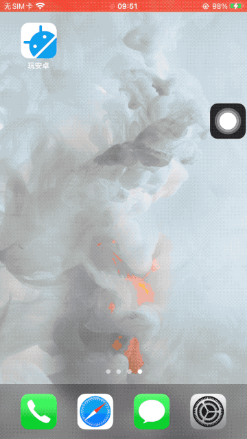
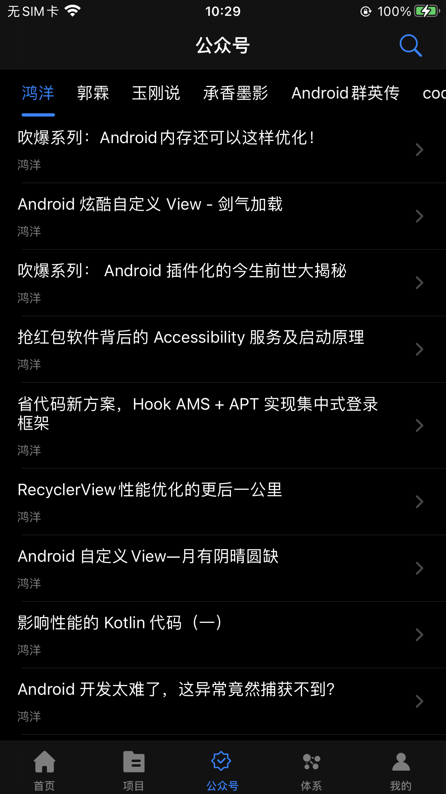
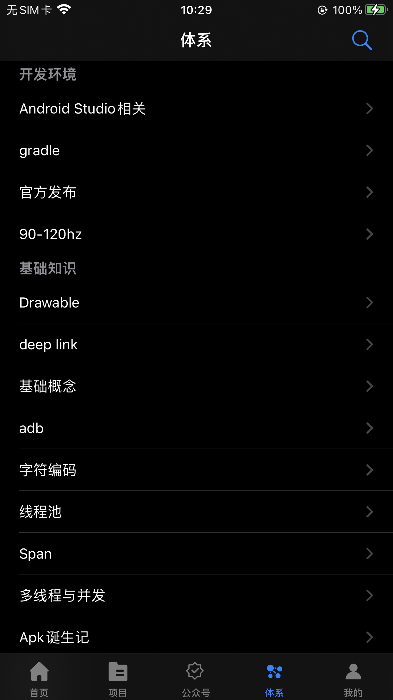
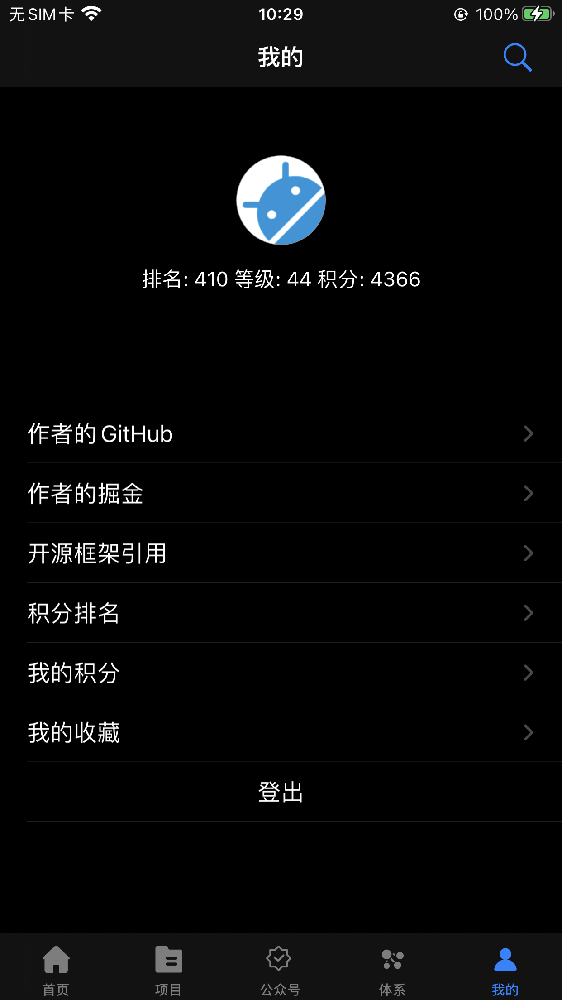
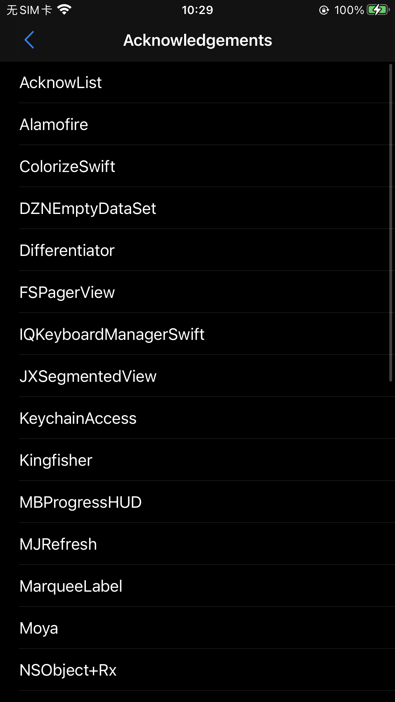
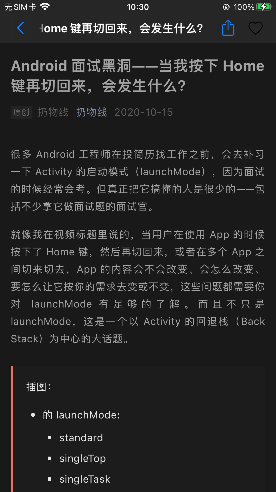

# 使用RxSwift编写iOS的wanandroid客户端

## 前言

尝试学习RxSwift已经是很久之前的事情了，今年通过掘金的活动才基本落地。

之前版本的README写的乱七八糟的，一直想找个机会重新整理一下。

拖拖拉拉的一直推迟到现在，真是不好意思。

## 关于这个项目

这是我第一个Swift的MVVM项目，依旧通过[WanAndroid开放API](https://www.wanandroid.com/)制作。

我已经写了Flutter和uni-app版本，所以Swift版本更看重是对逻辑与RxSwift的理解。

曾经的我更看重在单个UI页面上的编写与实现，现在经常想的是这个有没有现成的轮子可以，更偏向于思路与思考。我不是说UI不需要思考，如果有好用的轮子何乐而不为呢？

**欢迎大家star、pr和一起讨论！！！**

### 项目截图

#### 先来一张动图

<div align="center">



</div>

#### 界面截图
 
|  |  |  |  |
| --- | --- | --- | --- |
|  |  |  |  |  

### 功能说明

* 首页、项目、公众号、体系、我的，五大模块
* 登录注册功能
* 搜索功能：热门搜索、输入搜索
* 文章列表，普通的TableView布局
* Tab切换功能
* 自动轮播图
* MJRefresh的下拉刷新，无感知上拉加载更多
* RxMoya的使用，Moya插件的使用
* RxSwift、RxCocoa的响应式编程，ViewModel的绑定
* 适配iOS 15
* 适配黑暗模式
* 常用扩展封装
* 详细的注释与思考过程

### 引入的第三库

```
# Rx Core
pod 'RxSwift'
pod 'RxCocoa'

# Networking
pod 'Moya/RxSwift'

# Rx Extensions
pod 'RxDataSources'
pod 'RxSwiftExt' #暂时没有使用,更多的是对序列的运算符优化
pod 'RxViewController' # 暂时没有使用
pod 'RxGesture' # 暂时没有使用
pod 'RxOptional' # 暂时没有使用
pod 'RxTheme' # 暂时没有使用,可以做主题优化,但是现在基本上适配黑暗模式即可
pod 'RxBlocking' # 暂时没有使用
pod 'NSObject+Rx'

# Image
pod 'Kingfisher'
# Date
pod 'SwiftDate' # 暂时没有使用

# Tools
pod 'R.swift'

# Keychain
pod 'KeychainAccess' # 暂时没有使用

# UI'
pod 'DZNEmptyDataSet'
pod 'AcknowList'
pod 'MBProgressHUD' # 被SVProgressHUD替代了
pod 'MJRefresh'
pod 'FSPagerView'
pod 'JXSegmentedView'
pod 'MarqueeLabel'
pod 'SVProgressHUD'
  
# Keyboard
pod 'IQKeyboardManagerSwift'

# Auto Layout
pod 'SnapKit'

# 打印日志
pod "SwiftPrettyPrint", "~> 1.2.0", :configuration => "Debug" # enabled on `Debug` build only
    
# SFSymbols的安全引用
pod 'SFSafeSymbols', '~> 2.1.3' #暂时没有使用
```

## 使用RxSwift、Flutter、Vue的一点感受

之前跑去学了Flutter和简单的Vue入门。

说实话Vue的学习成本是最低的，因为它的MVVM框架开箱即用，你不需要做太多的操作，也非常容易理解。

Flutter的学习曲线稍微难一点，但是学会了Provider之后，基本上MVVM的思想也上路了。

反观RxSwift的学习曲线真的是陡峭啊，虽然我理解Oberveral其实就是异步的stream，但是使用起来的时候还是一脸懵逼，偶尔想要使用绑定，还需要自己做Rx的扩展，需要理解大量非原生的API，成本非常的高。

你说为啥不直接上Combine，我只是想说，RxSwift学了，理解Combine还会难么？

SwiftUI+Combine联合起来才能展现威力，不过在苹果这一侧，成熟好用的响应式和状态管理都还没有出世。

而RxSwift系列的一些框架已经在向大前端的实现了，可惜对原生的支持不够好的，学习成本也太高了。

## Flutter版wanandroid客户端

[项目地址](https://github.com/seasonZhu/FlutterPlayAndroid)

## uni-app版wanandroid客户端

[项目地址](https://github.com/seasonZhu/UniAppPlayAndroid)

## 我的掘金主页

[我的主页](https://juejin.cn/user/4353721778057997)

